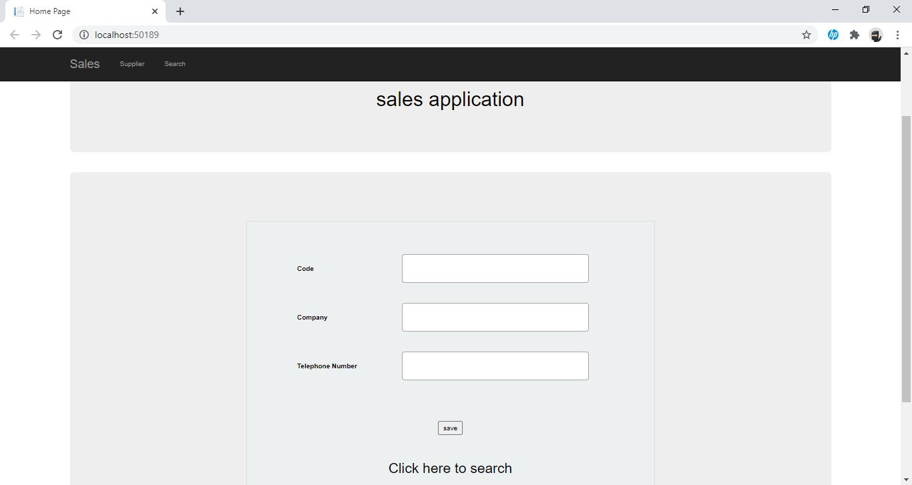
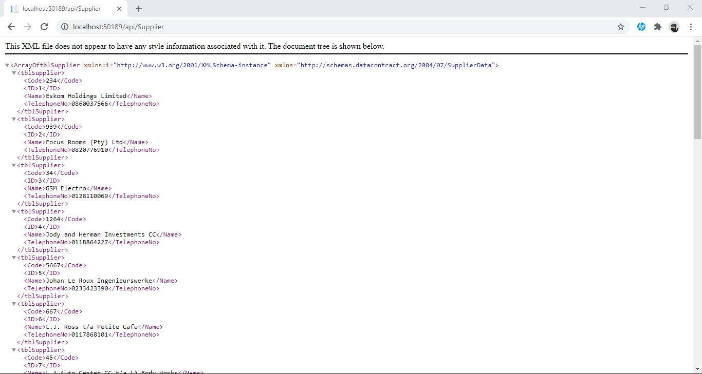
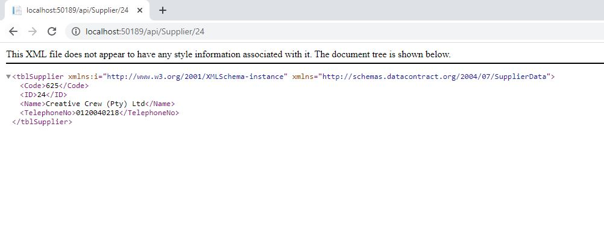

# Enversoft-Exercise3
Web API application with SQL database

                                                                        ASP .Net Web API

                                                                        MY-SQL Database

                                                                    Ado .Net Entity Framework

Records in Supplier Database

Can search for record using id in url localhost:50189/api/Supplier/2

(2 = record id in database)

